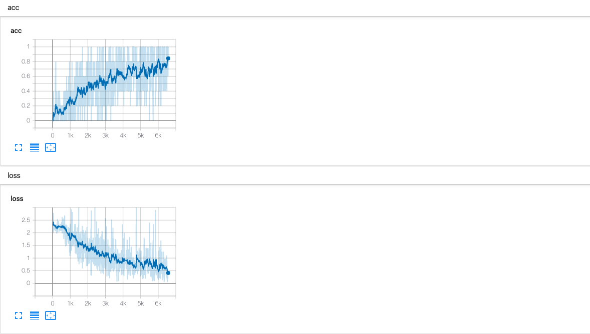
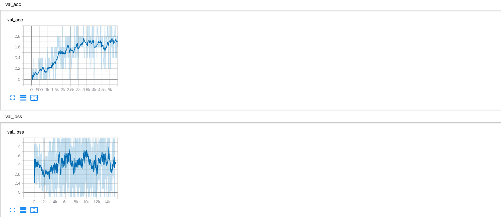

[WIP] Implemention of Recurrent Models of Visual Attention

* Requirments
---
1. pytorch1.0+
2. python 3.6
3. opencv

* Structure
---
src
* model.py: Contains the main model
* dataloader.py: Dataloader for pytorch
* glimpse.py: Glimpse Sensor Network used in model
* utils.py: Utilities functions
* solver.py: Main training code

* Results
---
Results for small dataset of 100 images.
Training Accuracy reached 100% indicating that the model is able to overfit a small dataset

Training Accuracy reached 100% on validation set

